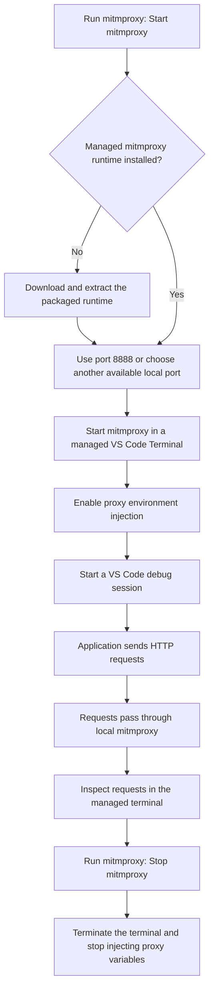

# Request Inspector

Request Inspector helps developers inspect outgoing HTTP requests while running and debugging code in VS Code. It downloads a managed `mitmproxy` runtime from Request Inspector GitHub Releases into `~/.request-inspector`, starts a local proxy in a managed VS Code Terminal, and automatically injects proxy environment variables into VS Code debug sessions while the proxy is active.

The goal is zero configuration for day-to-day development: start the proxy, run your code, and check whether the requests your program sends are correct.

## Features

- Managed `mitmproxy` runtime: downloads the packaged runtime into `~/.request-inspector` when needed.
- One-click proxy control: start, stop, restart, toggle, or focus the managed proxy from the command palette and Status Bar.
- Default proxy port: uses `8888` when available and falls back to another available local port when needed.
- Native terminal experience: runs `mitmproxy` in a regular VS Code Terminal so captured traffic stays visible and interactive.
- Debug-session proxy injection: adds `HTTP_PROXY`, `HTTPS_PROXY`, and `ALL_PROXY` while the proxy is running, without modifying `.vscode/launch.json`.

## Managed Runtime

Request Inspector downloads the packaged `mitmproxy` runtime automatically from GitHub Releases. The first startup may take longer while the runtime is installed into `~/.request-inspector`. Managed installation currently supports packaged runtime assets for macOS arm64/x64, Linux arm64/x64, and Windows x64.

## Typical Workflow

In practice, start `mitmproxy` before launching your application debug session. On first use, Request Inspector installs the packaged runtime, uses port `8888` when available, and opens a managed VS Code Terminal for the proxy. If `8888` is already in use, it falls back to another available local port. While the proxy is running, new debug sessions receive standard proxy environment variables so supported HTTP clients send traffic through local `mitmproxy`. When inspection is finished, stop `mitmproxy` to close the managed terminal and disable proxy injection for future debug sessions.

## Limitations

Request Inspector depends on applications respecting standard proxy environment variables. Some runtimes, SDKs, or HTTP clients may need their own proxy configuration.

To inspect HTTPS traffic, the application or system trust store must trust the mitmproxy certificate authority. See the official [mitmproxy certificate documentation](https://docs.mitmproxy.org/stable/concepts/certificates/) for setup details.
