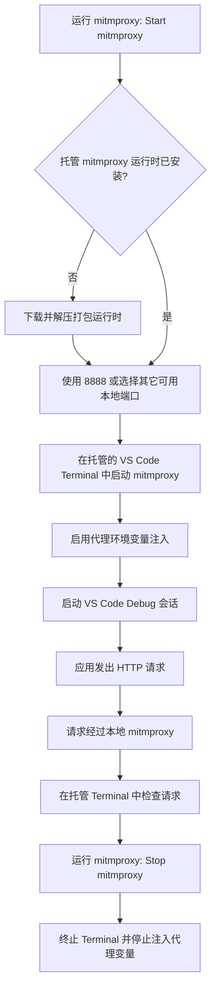

# Request Inspector

Request Inspector 帮助开发者在 VS Code 中运行和调试代码时检查程序发出的 HTTP 请求。它会从 Request Inspector GitHub Releases 将托管的 `mitmproxy` 运行时下载到 `~/.request-inspector`，在 VS Code 原生 Terminal 中启动本地代理，并在代理启用期间自动为 VS Code Debug 会话注入代理环境变量。

目标是让日常开发尽量零配置：启动代理，运行代码，然后检查程序发出去的请求是否正确。

## 功能

- 托管 `mitmproxy` 运行时：按需将打包好的运行时下载到 `~/.request-inspector`。
- 一键代理控制：通过命令面板和 Status Bar 启动、停止、重启、切换或聚焦托管代理。
- 默认代理端口：优先使用 `8888`，如被占用则回退到其它可用本地端口。
- 原生 Terminal 体验：在常规 VS Code Terminal 中运行 `mitmproxy`，让捕获到的流量保持可见且可交互。
- Debug 会话代理注入：代理运行期间自动添加 `HTTP_PROXY`、`HTTPS_PROXY` 和 `ALL_PROXY`，且不修改 `.vscode/launch.json`。

## 托管运行时

Request Inspector 会自动从 GitHub Releases 下载打包好的 `mitmproxy` 运行时。首次启动可能需要一些时间，运行时会安装到 `~/.request-inspector`。托管安装目前支持 macOS arm64/x64、Linux arm64/x64 和 Windows x64 的打包运行时资产。

## 典型工作流

实际使用时，请先启动 `mitmproxy`，再启动应用的 Debug 会话。首次使用时，Request Inspector 会安装打包运行时，并在可用时使用 `8888` 作为代理端口，为代理打开一个托管的 VS Code Terminal。如果 `8888` 已被占用，则会回退到其它可用本地端口。代理运行期间，新的 Debug 会话会收到标准代理环境变量，支持这些变量的 HTTP 客户端会把流量发送到本地 `mitmproxy`。检查完成后，停止 `mitmproxy` 即可关闭托管 Terminal，并停止为后续 Debug 会话注入代理变量。

## 限制

Request Inspector 依赖应用遵循标准代理环境变量。部分运行时、SDK 或 HTTP 客户端可能需要额外的代理配置。
