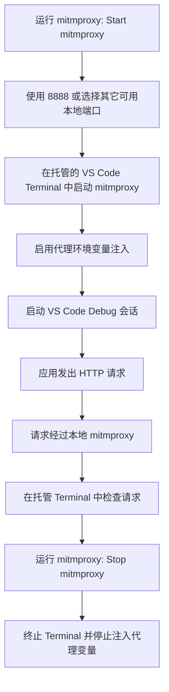

# Request Inspector

Request Inspector 帮助开发者在 VS Code 中运行和调试代码时检查程序发出的 HTTP 请求。它会在托管的 VS Code Terminal 中启动系统 `mitmproxy` 命令，并在代理启用期间自动为 VS Code Debug 会话注入代理环境变量。

安装 `mitmproxy` 后，目标是让日常开发尽量零配置：启动代理，运行代码，然后检查程序发出去的请求是否正确。

## 功能

- 系统 `mitmproxy` 运行时：使用 `PATH` 中可用的 `mitmproxy` 命令。
- 一键代理控制：通过命令面板和 Status Bar 启动、停止、重启、切换或聚焦托管代理。
- 默认代理端口：优先使用 `8888`，如被占用则回退到其它可用本地端口。
- 原生 Terminal 体验：在常规 VS Code Terminal 中运行 `mitmproxy`，让捕获到的流量保持可见且可交互。
- Debug 会话代理注入：代理运行期间自动添加 `HTTP_PROXY`、`HTTPS_PROXY` 和 `ALL_PROXY`，且不修改 `.vscode/launch.json`。

## 依赖

启动代理前，请先在系统中安装 `mitmproxy`。Request Inspector 会运行 `PATH` 中的 `mitmproxy` 命令，不会自动下载或安装运行时。

## 典型工作流

实际使用时，请先启动 `mitmproxy`，再启动应用的 Debug 会话。Request Inspector 会在可用时使用 `8888` 作为代理端口，并为代理打开一个托管的 VS Code Terminal。如果 `8888` 已被占用，则会回退到其它可用本地端口。代理运行期间，新的 Debug 会话会收到标准代理环境变量，支持这些变量的 HTTP 客户端会把流量发送到本地 `mitmproxy`。检查完成后，停止 `mitmproxy` 即可关闭托管 Terminal，并停止为后续 Debug 会话注入代理变量。

## 限制

Request Inspector 依赖应用遵循标准代理环境变量。部分运行时、SDK 或 HTTP 客户端可能需要额外的代理配置。

如果要检查 HTTPS 流量，应用或系统信任库需要信任 mitmproxy 的证书颁发机构。具体配置方式请参考官方 [mitmproxy 证书文档](https://docs.mitmproxy.org/stable/concepts/certificates/)。
